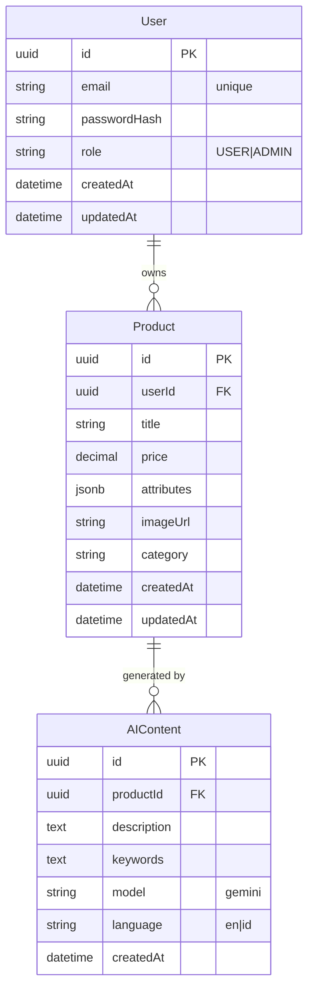

Got it 🚀 — here’s a **full PRD** combined with a clean **API Endpoint Table** and **compact ERD** all in one Markdown file. You can drop this directly into your repo README or use it as input for Claude Code to scaffold everything.

---

````markdown
# 📑 Product Requirements Document (PRD)  
**Project Name:** AI-Powered Marketplace Product Helper  
**Prepared by:** [Your Name]  
**Date:** [2025-09-07]  
**Version:** 1.1  

---

## 1. Overview  
This is a **web application** for online sellers (Shopee, Tokopedia, Amazon, Etsy, etc.) to generate **professional product descriptions, SEO keywords, and categories** using **Gemini AI**.  
The backend is built with **Express.js, Prisma ORM, and PostgreSQL**, and the frontend with **Next.js + Tailwind CSS**.  

---

## 2. Goals & Objectives  
- Help sellers create better listings quickly.  
- Showcase backend skills with Express.js + Prisma + PostgreSQL.  
- Integrate Gemini AI for content generation.  
- Deploy as a working MVP demo in 3 days.  

---

## 3. Key Features (MVP)  
- **Auth:** Register, login with JWT.  
- **Product Management:** CRUD for products (title, price, attributes, category, image).  
- **AI Generation:** Generate description, keywords, and category via Gemini.  
- **Export:** Products downloadable as CSV.  

---

## 4. User Stories  

**Seller (Main User)**  
- I can register and log in.  
- I can create, edit, delete, and view my products.  
- I can generate descriptions with Gemini AI.  
- I can export products to CSV.  

**Admin (Optional, v2)**  
- I can see all users and AI usage logs.  

---

## 5. Functional Requirements  

### Backend  
- Express.js + Prisma + PostgreSQL.  
- REST API with JWT auth.  
- Models: `User`, `Product`, `AIContent`.  

### Frontend  
- Next.js + Tailwind.  
- Login page.  
- Product dashboard (list, CRUD).  
- “Generate with AI” button → backend call → editable text.  

### AI (Gemini)  
- Endpoint to generate product description + SEO keywords + category.  
- Language support: EN, ID.  

---

## 6. Non-Functional Requirements  
- **Performance:** AI response < 8s.  
- **Security:** JWT, bcrypt, CORS.  
- **Scalability:** PostgreSQL on Supabase/Neon.  
- **Maintainability:** Modular services (auth, product, AI).  
- **Deployment:** Backend (Railway/Render), Frontend (Vercel).  

---

## 7. Tech Stack  
- **Backend:** Express.js, Prisma ORM, PostgreSQL  
- **AI:** Gemini API  
- **Frontend:** Next.js, Tailwind CSS  
- **Deployment:** Vercel (frontend), Railway/Render (backend), Supabase/Neon (DB)
- **Local Dev:** Docker Compose with hot reload (volumes for code sync, nodemon for backend autoreload, no rebuild on changes)

---

## 8. Success Metrics  
- Product description generated in < 10s.  
- CSV export works 100%.  
- At least 80% of generated content is editable by user.  

---

## 9. Risks & Mitigation  
- **Gemini API cost** → Add usage limits.  
- **Bad AI results** → Allow user edits before saving.  
- **Data loss** → Enable database backups.  

---

## 10. Timeline (3 Days MVP)  
- **Day 1:** Setup, DB schema, Auth, CRUD Products.  
- **Day 2:** AI integration (Gemini) + AI logs.  
- **Day 3:** Export CSV, minimal frontend, deployment.  

---

# 📌 API Endpoint Table  

### Auth  
| Method | Path | Auth | Body | Response | Notes |
|--------|------|------|------|----------|-------|
| POST | `/auth/register` | No | `{ "email": "string", "password": "string" }` | `{ "user": { "id":"...", "email":"..." } }` | Hash password (bcrypt) |
| POST | `/auth/login` | No | `{ "email":"string", "password":"string" }` | `{ "token":"jwt", "user":{ "id":"...", "email":"..." } }` | JWT expires 7d |

### Products  
| Method | Path | Auth | Body / Query | Response | Notes |
|--------|------|------|--------------|----------|-------|
| POST | `/products` | Yes | `{ "title":"string", "price":0, "attributes":{…}, "imageUrl":"", "category":"string" }` | `Product` | Owner = logged-in user |
| GET | `/products` | Yes | `?page=1&limit=10&search=shoe` | `{ "items":[…], "page":1, "limit":10, "total":42 }` | Pagination + filter |
| GET | `/products/:id` | Yes | — | `Product` | 404 if not owner |
| PUT | `/products/:id` | Yes | Partial body | `Product` | Only owner can update |
| DELETE | `/products/:id` | Yes | — | `{ "deleted": true }` | Soft delete optional |

**Product Shape (Response):**
```json
{
  "id":"uuid",
  "userId":"uuid",
  "title":"string",
  "price":100000,
  "attributes":{ "brand":"Nike","color":"Black","size":"M" },
  "imageUrl":"string",
  "category":"string",
  "createdAt":"ISO",
  "updatedAt":"ISO"
}
````

### AI (Gemini)

| Method | Path                      | Auth | Body                                                   | Response | Notes                                                                 |                           |
| ------ | ------------------------- | ---- | ------------------------------------------------------ | -------- | --------------------------------------------------------------------- | ------------------------- |
| POST   | `/ai/generate`            | Yes  | \`{ "title":"string", "attributes":{…}, "language":"en | id" }\`  | `{ "description":"string", "keywords":["..."], "category":"string" }` | Logs saved to `AIContent` |
| POST   | `/ai/generate/:productId` | Yes  | \`{ "language":"en                                     | id" }\`  | same as above + `productId`                                           | Uses existing product     |

### Export

| Method | Path                   | Auth | Query        | Response | Notes                                                              |
| ------ | ---------------------- | ---- | ------------ | -------- | ------------------------------------------------------------------ |
| GET    | `/export/products.csv` | Yes  | `search=...` | CSV file | Columns: title, price, category, attributes, description, keywords |

### Health

| Method | Path      | Auth | Response         |
| ------ | --------- | ---- | ---------------- |
| GET    | `/health` | No   | `{ "ok": true }` |

---

# 📂 Compact ERD



---

# ✅ Notes for Implementation

* Use Prisma migrations to generate DB schema.
* Secure JWT middleware for all protected routes.
* Rate limit `/ai/generate` (e.g., 5 requests/day for free users).
* CSV export via `fast-csv` or manual `array.join()`.
* Keep AI prompt short and structured for Gemini.
* Use Docker Compose for local development: Setup Dockerfiles for backend/frontend, docker-compose.yml with volumes (./backend:/app, ./frontend:/app) for hot reload on file changes, nodemon in backend Dockerfile for automatic restarts, PostgreSQL service with init scripts. Run `docker-compose up` for full stack without rebuilding on every code change.

---

```
